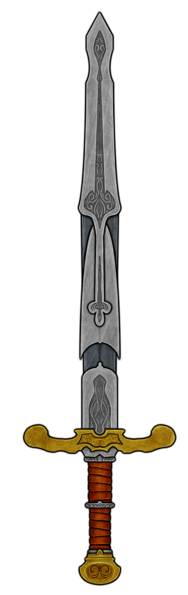

# Basic Information
> [!infobox]
> # Evershift
> 
> ##### Information
> |   |  |
> | ---- | ---- |
> | Other names | |
> | Type|item|
> | Keeper | [Adeena Oberon](../../PCs/Adeena%20Oberon.md)|
> | Past Keeper| [Mathudim Strongbolt](../../Lore/Mythical%20Heroes/Mathudim%20Strongbolt.md)|
> ##### Attributes
> |   |  |
> | ---- | ---- |
> | Weapon Mode  | **Longsword**  |
> | Damage| 1d8 slashing|
> | Properties| Heavy, Versatile (1d10)|
> | Weight | 15 lbs. |
> | | |
> | Weapon Mode | **Greatsword**  |
> | Damage| 2d6 slashing|
> | Properties| Heavy, Two-Handed|
> | Weight | 15 lbs. |

## Description
The [Evershift](Evershift.md) is a sword of intricate dwarven design and ingenuity. Internal counterweight mechanisms allow the sword to shift its apparent weight, making it unwieldy to the uninitiated but a fearsome weapon to a trained one. Finally, [Mathudim](../../Lore/Mythical%20Heroes/Mathudim%20Strongbolt.md)'s design renders the [Evershift](Evershift.md) durable and protected to disassembly, as if a magic weapon.
### Mythic Keeper: [Mathudim Strongbolt](../../Lore/Mythical%20Heroes/Mathudim%20Strongbolt.md)
The [Evershift](Evershift.md) is created and wielded by [Mathudim](../../Lore/Mythical%20Heroes/Mathudim%20Strongbolt.md) during [The Great War](../../Lore/Kippian-Sumber%20War.md). The weapon gave [Mathudim](../../Lore/Mythical%20Heroes/Mathudim%20Strongbolt.md) a unique style of fighting, one that is seemingly unbeatable and adaptable to any battle.
# Properties
## Sword Shift
As a bonus action, you can twist the sword's hilt to switch between its longsword mode or its greatsword mode.
## Evershift Expert
You have a +1 bonus to attack and damage rolls made with this weapon. While wielding this weapon, your walking speed is increased by 10 feet.
## Spinning Swing
You can use your bonus action to deal 1 slashing damage to all creatures within your reach.
## Driving Swing
If you attack immediately after moving, you can use your bonus action to gain a +1 bonus (max of +5) to your attack's damage roll for every 10 feet of unbroken movement done in a straight line.
# Story Log
## Most Recent

## All Entries
