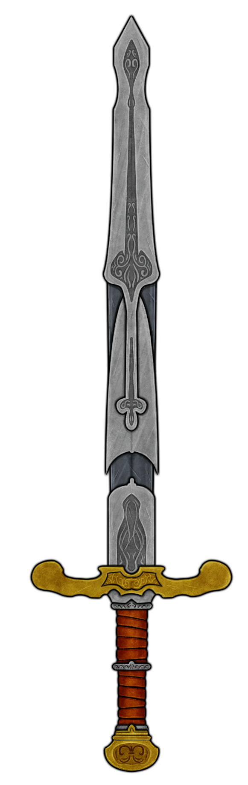

# Basic Information
> [!infobox]
> # Evershift
> 
> ##### Information
> |   |  |
> | ---- | ---- |
> | Other names | |
> | Type|item|
> | Keeper | [Adeena Oberon](../../PCs/Adeena%20Oberon.md)|
> | Past Keeper| [Mathudim Strongbolt](../../Lore/Mythical%20Heroes/Mathudim%20Strongbolt.md)|
> ##### Attributes
> |   |  |
> | ---- | ---- |
> | Weapon Mode  | **Longsword**  |
> | Damage| 1d8 slashing|
> | Properties| Heavy, Versatile (1d10)|
> | Weight | 15 lbs. |
> | | |
> | Weapon Mode | **Greatsword**  |
> | Damage| 2d6 slashing|
> | Properties| Heavy, Two-Handed|
> | Weight | 15 lbs. |

## Description
The [Evershift](Evershift.md) is a sword of intricate dwarven design and ingenuity. Internal counterweight mechanisms allow the sword to shift its apparent weight, making it unwieldy to the uninitiated but a fearsome weapon to a trained one. Finally, [Mathudim](../../Lore/Mythical%20Heroes/Mathudim%20Strongbolt.md)'s design renders the [Evershift](Evershift.md) durable and protected to disassembly, as if a magic weapon.
### Mythic Keeper: [Mathudim Strongbolt](../../Lore/Mythical%20Heroes/Mathudim%20Strongbolt.md)
The [Evershift](Evershift.md) is created and wielded by [Mathudim](../../Lore/Mythical%20Heroes/Mathudim%20Strongbolt.md) during [The Great War](../../Lore/Kippian-Sumber%20War.md). The weapon gave [Mathudim](../../Lore/Mythical%20Heroes/Mathudim%20Strongbolt.md) a unique style of fighting, one that is seemingly unbeatable and adaptable to any battle.
# Properties
## Sword Shift
As a bonus action, you can twist the sword's hilt to switch between its longsword mode or its greatsword mode.
## Evershift Master
You master the Evershift and its workings. You have a +2 bonus to attack and damage rolls made with this weapon. While wielding this weapon, you gain the following: 
- your walking speed is increased by 10 feet.
- you can jump three times the normal distance, though you can't jump farther than your remaining movement would allow. 
## Spinning Swing
You can use your bonus action to deal 1 slashing damage to all creatures within your reach.
## Driving Swing
If you attack immediately after moving, you can use your bonus action to gain a +1 bonus (max of +5) to your attack's damage roll for every 10 feet of unbroken movement done in a straight line.
## Leaping Swing
You are use the Evershift's shifting weight as momentum to your jumps. If you Attack a creature immediately after jumping and it hits, instead of dealing damage you can choose to automatically succeed a shove attack. The target creature must be no more than one size larger than you.
# Story Log
## Most Recent
- [Session 54](../../Session%20Log/Session%2054.md): At the last moment, [Adeena](Adeena%20Oberon.md) retrieves the [Evershift](Evershift.md) and drives it into [Kayriel](Kayriel%20Acquermann.md)'s chest. [Adeena](Adeena%20Oberon.md) takes four hits from the incoming crossbow bolts. A scream from a woman reverberates within the arena.
> *"He's dead!"*
- [Session 57](../../Session%20Log/Session%2057.md): [Arc](Arc.md) investigates and sees the wound on [Kayriel](Kayriel%20Acquermann.md)'s chest. He is sure that [Adeena](Adeena%20Oberon.md)'s [Evershift](Evershift.md) is the cause of the wound.
- [Session 73](../../Session%20Log/Session%2073.md): A building collapses in front of the [party](Seven%20Up....md). [Adeena](Adeena%20Oberon.md) jumps across the wreckage using momentum from the [Evershift](Evershift.md).

## All Entries
- [Session 54](../../Session%20Log/Session%2054.md): At the last moment, [Adeena](Adeena%20Oberon.md) retrieves the [Evershift](Evershift.md) and drives it into [Kayriel](Kayriel%20Acquermann.md)'s chest. [Adeena](Adeena%20Oberon.md) takes four hits from the incoming crossbow bolts. A scream from a woman reverberates within the arena.
> *"He's dead!"*
- [Session 57](../../Session%20Log/Session%2057.md): [Arc](Arc.md) investigates and sees the wound on [Kayriel](Kayriel%20Acquermann.md)'s chest. He is sure that [Adeena](Adeena%20Oberon.md)'s [Evershift](Evershift.md) is the cause of the wound.
- [Session 73](../../Session%20Log/Session%2073.md): A building collapses in front of the [party](Seven%20Up....md). [Adeena](Adeena%20Oberon.md) jumps across the wreckage using momentum from the [Evershift](Evershift.md).
