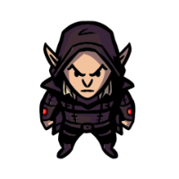

# Bio
> [!infobox]
> # Arc
> 
> ##### Bio
> |  |  |
> | ---- | ---- |
> | Aliases | Arc|
> | Race| elf |
> | Gender| male|
> | Age | |
> | Alignment|| 
> | Background| rogue|
> | Location|  |
> | Faction| [Seven Up...](../Factions/Seven%20Up....md)| 
#### Known for: being a rogue with a severe bout of amnesia
## Description
### Class: Rogue
### Subclass: [Phantom Rogue](https://dnd5e.wikidot.com/rogue:phantom)
## Relationships
# Story log
## Most Recent
- [Session 49](../Session%20Log/Session%2049.md): [Arc](Arc.md) finds a thieves' cant symbol for a black market store. [Arc](Arc.md) follows it, but he bumps a sketchy halfling in a narrow alleyway. He keeps the 1 cp coin he found from the halfling. The halfling promises to guide [Arc](Arc.md) to the black market store.
- [Session 49](../Session%20Log/Session%2049.md): [Arc](Arc.md) finds a stall in the wall. A masked halfling mans the store. [Arc](Arc.md) buys 2 packs of caltrops, 10 daggers, a vial of poison, thieves' tools, and 60 arrows for 200 gp.
- [Session 49](../Session%20Log/Session%2049.md): The halfling guide tugs on [Arc](Arc.md), asking for some donatin. [Arc](Arc.md) gifts 2 gp (and the 1 cp) to the halfling. The masked shopkeeper remarks that [Arc](Arc.md) is too generous for a thief.
- [Session 49](../Session%20Log/Session%2049.md): An elvish priest recognizes [Arc](Arc.md) and [Theobald](Theobald%20Clayhollow.md). The priest calls himself [Father Drenn](Drenn%20Halyx.md).
- [Session 49](../Session%20Log/Session%2049.md): [Adeena](Adeena%20Oberon.md), [Arc](Arc.md), [Adikia](Adikia%20Unalome.md) and [Theobald](Theobald%20Clayhollow.md) return to [Ironfleet Compound](Ironfleet%20Compound.md). [Theobald](Theobald%20Clayhollow.md), [Adikia](Adikia%20Unalome.md) and [Adeena](Adeena%20Oberon.md) decide to go to check on the dragon appearing in [Ankyra's Old Castle Compound](Ankyra's%20Old%20Castle%20Compound.md).
- [Session 49](../Session%20Log/Session%2049.md): [Splix](Spraugh%20'Splix'%20Calix.md) casts Arcane Eye and attempts to enter the portal with it. The dragon senses this, but [Elvin](Elvin%20Claymore.md) persuades the dragon not to worry about it as it poses no threat. [Elvin](Elvin%20Claymore.md) mocks the party. [Adikia](Adikia%20Unalome.md) is irate; sensing a provocation, [Mitarella](Mitarella%20Randall.md) coaxes [Adikia](Adikia%20Unalome.md):
> *"Let them have this day."*
- [Session 51](../Session%20Log/Session%2051.md): [Arc](Arc.md) ascends the stairs to the second floor. He sees a makeshift camp. [Arc](Arc.md) checks it, and sees a foot-high pile of books written by [Dorfir Embersense](Dorfir%20Embersense.md). [Arc](Arc.md) also steals a pack of rations.
- [Session 51](../Session%20Log/Session%2051.md): [Arc](Arc.md) scours the second floor and sees two humanoids, a bearded old elf and a female human, resting on a table. After a brief confrontation, [Arc](Arc.md) determines that the two are [Splix](Spraugh%20'Splix'%20Calix.md)'s colleagues: [Dorfir Embersense](Dorfir%20Embersense.md) and [Fiamil](Fiamil%20Underwood.md).
- [Session 51](../Session%20Log/Session%2051.md): [Arc](Arc.md) recovers [Theobald](Theobald%20Clayhollow.md)'s [Matunda's Mace](Matunda's%20Mace.md), along with a tiara and a hefty amount of gold.
- [Session 51](../Session%20Log/Session%2051.md): [Theobald](Theobald%20Clayhollow.md) casts revivify on both [Dorfir Embersense](Dorfir%20Embersense.md) and [Fiamil Underwood](Fiamil%20Underwood.md). [Arc](Arc.md) uses the diamond from the tiara for one cast.

## All Entries
- [Session 13](../../Session%2013.md): [Arc](Arc.md) learns that wood elves are locals of the [Soliven Forest](Soliven%20Forest.md).
- [Session 14](../../Session%2014.md): Inside [The Weeping WIllow](The%20Weeping%20WIllow.md), the [[Seven Up...|party]] meets four representatives from four noble families of [Midkip](Midkip.md): [Armand Gorrel](Armand%20Gorrel.md), a human of [Lykos](Lykos%20District.md); [Djorken Veegar](Djorken%20Veegar.md), a red dragonborn hailing from [Drakon](Drakon%20District.md), [Gandour Ironfleet](Gandour%20Ironfleet.md) from [Chtapodhi](Chtapodhi%20District.md), and [Janna Furwish](Janna%20Furwish.md) from [Aetos](Aetos%20District.md). [Kirren](Kirren%20Acquermann.md) and [Arc](Arc.md) are also present here.
- [Session 31](../../Session%2031.md): [[Seven Up...|Party]] wakes up. [Arc](Arc.md), [Noah](Noah%20Skie.md) and [Kirren](Kirren%20Acquermann.md) is not in the quarters.
- [Session 32](../../Session%2032.md): [Arc](Arc.md) woke up and went to [Kayvan](Kayvan%20Acquermann.md)'s room.
- [Session 32](../../Session%2032.md): [Arc](Arc.md) met a mysterious tall man inside [Kayvan](Kayvan%20Acquermann.md)'s room.
- [Session 32](../../Session%2032.md): [Arc](Arc.md) met the [[Seven Up...|party]].
- [Session 32](../../Session%2032.md): [Arc](Arc.md) is interrogated by the [[Seven Up...|party]].
- [Session 32](../../Session%2032.md): [Arc](Arc.md), [Kiris](Kiris%20Acquermann.md), [Thoradin](Thoradin%20Goodman.md) and [Splix](Spraugh%20'Splix'%20Calix.md) goes to [Kayvan](Kayvan%20Acquermann.md)'s room.
- [Session 33](../../Session%2033.md): [Korvin](Korvin%20Acquermann.md) and [Kayriel](Kayriel%20Acquermann.md) are revealed to be members of [The Cult of Miledu](The%20Cult%20of%20Miledu.md). [Korvin](Korvin%20Acquermann.md) is part of the eight cult members in [Bulkip](Bulkip.md), while [Kayriel](Kayriel%20Acquermann.md) is shown to be the figure that [Arc](Arc.md) met.
- [Session 34](../../Session%2034.md): [Adikia](Adikia%20Unalome.md), [Adeena](Adeena%20Oberon.md), [Theobald](Theobald%20Clayhollow.md), [Arc](Arc.md) and [Thoradin](Thoradin%20Goodman.md) enters the [Arcanus Labyrinthus](Arcanus%20Labyrinthus.md).
- [Session 35](../../Session%2035.md): [Kirren](Kirren%20Acquermann.md): "What if [Kayriel](Kayriel%20Acquermann.md) is not actually the individual [Arc](Arc.md) saw yesterday?"
- [Session 35](../../Session%2035.md): The [[Seven Up...|party]] uses the [Arcanus Labyrinthus](Arcanus%20Labyrinthus.md) to enter the [Labyrinthus](Labyrinthus.md).
- [Session 36](../../Session%2036.md): [Arc](Arc.md) and [Kiris](Kiris%20Acquermann.md) succumbs to freezing cold. Their shadows are longer and darker than before.
- [Session 38](../Session%20Log/Session%2038.md): The ghost then touches [Noah](Noah%20Skie.md), allowing her to change her Arcane Shot ability(Beguiling to Enfeebling).
- [Session 38](../Session%20Log/Session%2038.md): [Arc](Arc.md) hears whispers of the dead:
> Absence of the cold releaseth sand, and creatures of leather.
- [Session 38](../Session%20Log/Session%2038.md): During exploration, [Arc](Arc.md) sees a statue of [Zerrus Zagi](Zerrus%20Zagi.md). The inscription says,
> The Mad Mage lived within a sand tower. Those who tried to scale it are burnt asunder.
- [Session 38](../Session%20Log/Session%2038.md): [Arc](Arc.md) and the party encounters a [Blacksand Elemental](Blacksand%20Elemental.md).
- [Session 39](../Session%20Log/Session%2039.md): [Thoradin Goodman](Thoradin%20Goodman.md) retrieves (and keeps) the [Bloodstone Arcane Gem](Bloodstone%20Arcane%20Gem.md) (Fireball DC 15).
- [Session 40](../Session%20Log/Session%2040.md): [Arc](Arc.md) sees the following hallway inscription across the invisible barrier:
>Within the [Guardians of Ice and Fire](Guardians%20of%20Ice%20and%20Fire.md) are the keys to disabling the barrier that separates the hall...
- [Session 40](../Session%20Log/Session%2040.md): [Arc](Arc.md) discovers the statue that tells the discovery of the [Scepter of Akenatun](Scepter%20of%20Akenatun.md) by [Zerrus Zagi](Zerrus%20Zagi.md) and [Spekid Frostborn](Spekid%20Frostborn.md).
- [Session 41](../Session%20Log/Session%2041.md): [Theobald](Theobald%20Clayhollow.md), [Thoradin](Thoradin%20Goodman.md) and [Arc](Arc.md) receives gold for their exploration.
- [Session 41](../Session%20Log/Session%2041.md): The nameless [Shadow Knight](Shadow%20Knight.md) talks to the [[Seven Up...|party]].
> [Arc](Arc.md) shows the [Twilight Dagger](Twilight%20Dagger.md) to the [Shadow Knight](Shadow%20Knight.md).
> *"That weapon owes its power from the [Plane of Shadows](Shadowfell.md)"*
- [Session 41](../Session%20Log/Session%2041.md): [Arc](Arc.md) asks the casters about his [Twilight Dagger](Twilight%20Dagger.md)'s power.
> *"One day, you will lose the [Twilight Dagger](Twilight%20Dagger.md). Then your character will change; for better or worse is yet to be determined."*
- [Session 42](../Session%20Log/Session%2042.md): The [[Seven Up...|party]] incurs temporal displacement sickness. [Theobald](Theobald%20Clayhollow.md), [Arc](Arc.md) and [Adeena](Adeena%20Oberon.md) are more affected by the sickness.
- [Session 42](../Session%20Log/Session%2042.md): [Adeena](Adeena%20Oberon.md) opts to meditate and talk to [Aulephi](Aulephi.md). [Arc](Arc.md) opts to rest instead.
- [Session 42](../Session%20Log/Session%2042.md): [Professor Aufel](Aufel%20Fernquill.md) inspects the staff, and is boggled by it. [Splix](Spraugh%20'Splix'%20Calix.md) then shows the [Arcanus Labyrinthus](Arcanus%20Labyrinthus.md). [Professor Aufel](Aufel%20Fernquill.md) is understandably confused.
- [Session 42](../Session%20Log/Session%2042.md): [Arc](Arc.md) wakes up, and [Adeena](Adeena%20Oberon.md) is not in the room. She left the following note:
> [!NOTE]
> From [Adeena](Adeena%20Oberon.md)
> I need to fulfill my oath.
- [Session 42](../Session%20Log/Session%2042.md): [Arc](Arc.md) sneaks out of the [compound](Ankyra's%20Old%20Castle%20Compound.md) to sell some stuff. [Arc](Arc.md) stumbles upon a dagger with a [Sumberian](Sumber.md) design.
- [Session 43](../Session%20Log/Session%2043.md): [Arc](Arc.md) climbs the nearby structure and finds three [Dusk Talons](Dusk%20Talons.md) overlooking the [Compound](Ironfleet%20Compound.md).
- [Session 44](../Session%20Log/Session%2044.md): [Arc](Arc.md) and [Thoradin](Thoradin%20Goodman.md) looks for [Dusk Talon Assassins](Dusk%20Talons.md).
- [Session 44](../Session%20Log/Session%2044.md): [Arc](Arc.md) confronts a [Dusk Talon](Dusk%20Talons.md) and interrogates him.
- [Session 45](../Session%20Log/Session%2045.md): [Arc](Arc.md) tries to track the [Dusk Talon](Dusk%20Talons.md) assassins. He follows a set of tracks that leads him to a chimneyed-house. He enters and sees a city guard quarreling with his wife about financial issues. [Arc](Arc.md) leaves 10 [[Seven Up...|Seven Up...]]
- [Session 45](../Session%20Log/Session%2045.md): [Adikia](Adikia%20Unalome.md) sees [Arc](Arc.md) covered in soot. [Adikia](Adikia%20Unalome.md) laughs at him; annoyed, [Arc](Arc.md) looks at his surroundings, and spots a lizard tail wading underneath [Chtapodhi](Chtapodhi%20District.md)'s canal waters.
- [Session 45](../Session%20Log/Session%2045.md): The [[Seven Up...|party]] prepares for [Adeena](Adeena%20Oberon.md)'s excursion. [Kayvan](Kayvan%20Acquermann.md), [Kiris](Kiris%20Acquermann.md) and [Arc](Arc.md) will observe the meeting.
- [Session 45](../Session%20Log/Session%2045.md): [Adeena](Adeena%20Oberon.md) travels on land alone. [Arc](Arc.md), [Kayvan](Kayvan%20Acquermann.md) and [Kiris](Kiris%20Acquermann.md) go to the designated location using the waterways.
- [Session 45](../Session%20Log/Session%2045.md): Meanwhile, [Kayvan](Kayvan%20Acquermann.md), [Kiris](Kiris%20Acquermann.md), and [Arc](Arc.md) attempt to follow [Adeena](Adeena%20Oberon.md), but to no avail. In the end, they go back to the [compound](Ironfleet%20Compound.md) to enlist the [[Seven Up...|party]]'s help.
- [Session 46](../Session%20Log/Session%2046.md): [Arc](Arc.md) scouts the surroundings for [Dusk Talon](Dusk%20Talons.md) assassins, but sees none. He observes more [Chtapodhi](Chtapodhi%20District.md)'s residents walking freely near the [Ironfleet Compound](Ironfleet%20Compound.md).
- [Session 46](../Session%20Log/Session%2046.md): [Arc](Arc.md) steals 10 gp and a propaganda poster from a tattered rucksack. The following text is written on the poster:
> Death to the Veegars,
>
> Death to the dragonborn,
>
> Rebels for Malandar,
>
> Malandar for Drakon!
- [Session 46](../Session%20Log/Session%2046.md): [Kiris](Kiris%20Acquermann.md), [Thoradin](Thoradin%20Goodman.md), [Theobald](Theobald%20Clayhollow.md), [Arc](Arc.md) and [Noah](Noah%20Skie.md) go to [Drakon district](Drakon%20District.md) to gauge the situation. [Thoradin](Thoradin%20Goodman.md) convinces [Djorken](Djorken%20Veegar.md) to accompany them, saying that he'll protect him from possible harm.
- [Session 46](../Session%20Log/Session%2046.md): [Arc](Arc.md) and [Kiris](Kiris%20Acquermann.md) disguise as guards and successfully infiltrate the cadre of veteran guards escorting [Raveena Malandar](Raveena%20Malandar.md).
- [Session 46](../Session%20Log/Session%2046.md): [Raveena Malandar](Raveena%20Malandar.md) exits the stage. [Arc](Arc.md) and [Kiris](Kiris%20Acquermann.md) follow her. They follow her into a deserted grass park with large-trunked trees. [Raveena](Raveena%20Malandar.md) hides behind one, and the two follow her.
- [Session 46](../Session%20Log/Session%2046.md): [Arc](Arc.md) and [Kiris](Kiris%20Acquermann.md) determine that the cloaked individual is [Janna Furwish](Janna%20Furwish.md).
- [Session 46](../Session%20Log/Session%2046.md): After the conversation, [Janna](Janna%20Furwish.md) leaves, prompting [Arc](Arc.md) and [Kiris](Kiris%20Acquermann.md) to action.  The two manage to knock out and capture [Raveena](Raveena%20Malandar.md).
- [Session 46](../Session%20Log/Session%2046.md): [Kiris](Kiris%20Acquermann.md) assumes [Raveena Malandar](Raveena%20Malandar.md)'s identity. He goes back to the [Drakon Amphitheater](Drakon's%20Open%20Amphitheater.md) as [Raveena](Raveena%20Malandar.md) and without speaking, announces her leave to the guards. [Kiris](Kiris%20Acquermann.md) then messages the [Drakon](Drakon%20District.md) [[Seven Up...|party]] to meet him and [Arc](Arc.md) at a specific place within [Drakon](Drakon%20District.md).
- [Session 46](../Session%20Log/Session%2046.md): The [Drakon](Drakon%20District.md) [[Seven Up...|party]] saw [Arc](Arc.md) and [Kiris](Kiris%20Acquermann.md) carrying [Raveena](Raveena%20Malandar.md) who is bound and unconscious. [Djorken](Djorken%20Veegar.md) is startled, but [Kiris](Kiris%20Acquermann.md) manages to convince him that this is the best course to take. [Djorken](Djorken%20Veegar.md) reluctantly agrees, and shares his knowledge of a less-traveled route back to the [Ironfleet Compound](Ironfleet%20Compound.md) that would attract the least attention.
- [Session 47](../Session%20Log/Session%2047.md): [Noah](Noah%20Skie.md) spots [Arc](Arc.md) stealing a purse from a commoner.
- [Session 48](../Session%20Log/Session%2048.md): [Arc](Arc.md) scouts the district and finds a three-carriage supply run from [Ankyra's Old Castle Compound](Ankyra's%20Old%20Castle%20Compound.md) traveling to [Ironfleet Compound](Ironfleet%20Compound.md). He follows it and he meets [Kirren](Kirren%20Acquermann.md).
- [Session 48](../Session%20Log/Session%2048.md): [Kirren](Kirren%20Acquermann.md) asks [Arc](Arc.md) where to find [Kiris](Kiris%20Acquermann.md) and [Kayvan](Kayvan%20Acquermann.md); [Arc](Arc.md) supplies their location.
- [Session 48](../Session%20Log/Session%2048.md): The others, except [Arc](Arc.md), jumps into the shallow sea to save the two. [Arc](Arc.md) prepares the boat for an impact from a 5-foot tall wave.
- [Session 48](../Session%20Log/Session%2048.md): [Arc](Arc.md) sees a creature made of sand rushing into them. [Arc](Arc.md) jumps into the shore.
- [Session 48](../Session%20Log/Session%2048.md): The [[Seven Up...|party]] confronts a blacksand-based creature. [Arc](Arc.md), and later the other members of the [[Seven Up...|party]], ascertains that the blacksand combusts explosively. The explosion was too strong that the sound it produced reaches [Kiris](Kiris%20Acquermann.md).
- [Session 48](../Session%20Log/Session%2048.md): The creature throws [Adeena](Adeena%20Oberon.md) into the sea. Out of options, [Thoradin](Thoradin%20Goodman.md) casts a Fireball from his [Bloodstone Arcane Gem](Bloodstone%20Arcane%20Gem.md). The creature explodes, but not without creating a significant damage to the party.
- [Session 48](../Session%20Log/Session%2048.md): [Adikia](Adikia%20Unalome.md), [Theobald](Theobald%20Clayhollow.md), [Adeena](Adeena%20Oberon.md) and [Arc](Arc.md) arrives at the [Ironfleet Compound](Ironfleet%20Compound.md). They meet [Kirren](Kirren%20Acquermann.md) and [Gandour](Gandour%20Ironfleet.md) who are talking in the courtyard. [Adikia](Adikia%20Unalome.md), frustrated about [Nokia](Nokia.md), walks away from the conversation.
- [Session 49](../Session%20Log/Session%2049.md): [Kiris](Kiris%20Acquermann.md) decides to sleep in[Kayvan](Kayvan%20Acquermann.md)'s quarters with [Kirren](Kirren%20Acquermann.md). Before [Kiris](Kiris%20Acquermann.md) rests, [Thoradin](Thoradin%20Goodman.md) asks [Kiris](Kiris%20Acquermann.md) to cast Vortex Warp on the [Bloodstone Arcane Gem](Bloodstone%20Arcane%20Gem.md).
- [Session 49](../Session%20Log/Session%2049.md): [Adikia](Adikia%20Unalome.md) wakes up before dawn. She wakes the [[Seven Up...|party]], but only [Adeena](Adeena%20Oberon.md), [Theobald](Theobald%20Clayhollow.md) and [Arc](Arc.md) decide to accompany her.
- [Session 49](../Session%20Log/Session%2049.md): [Adikia](Adikia%20Unalome.md), [Adeena](Adeena%20Oberon.md), [Theobald](Theobald%20Clayhollow.md), and [Arc](Arc.md) go to [Foenyx](Foenyx%20District.md). With [Theobald](Theobald%20Clayhollow.md) guiding them, they arrive at the chapel at Roan Street. However, the chapel is closed still. [Arc](Arc.md), [Adeena](Adeena%20Oberon.md) and [Theobald](Theobald%20Clayhollow.md) separately check the district as [Adikia](Adikia%20Unalome.md) stays on a bench by the chapel doors.
- [Session 49](../Session%20Log/Session%2049.md): [Arc](Arc.md) finds a thieves' cant symbol for a black market store. [Arc](Arc.md) follows it, but he bumps a sketchy halfling in a narrow alleyway. He keeps the 1 cp coin he found from the halfling. The halfling promises to guide [Arc](Arc.md) to the black market store.
- [Session 49](../Session%20Log/Session%2049.md): [Arc](Arc.md) finds a stall in the wall. A masked halfling mans the store. [Arc](Arc.md) buys 2 packs of caltrops, 10 daggers, a vial of poison, thieves' tools, and 60 arrows for 200 gp.
- [Session 49](../Session%20Log/Session%2049.md): The halfling guide tugs on [Arc](Arc.md), asking for some donatin. [Arc](Arc.md) gifts 2 gp (and the 1 cp) to the halfling. The masked shopkeeper remarks that [Arc](Arc.md) is too generous for a thief.
- [Session 49](../Session%20Log/Session%2049.md): An elvish priest recognizes [Arc](Arc.md) and [Theobald](Theobald%20Clayhollow.md). The priest calls himself [Father Drenn](Drenn%20Halyx.md).
- [Session 49](../Session%20Log/Session%2049.md): [Adeena](Adeena%20Oberon.md), [Arc](Arc.md), [Adikia](Adikia%20Unalome.md) and [Theobald](Theobald%20Clayhollow.md) return to [Ironfleet Compound](Ironfleet%20Compound.md). [Theobald](Theobald%20Clayhollow.md), [Adikia](Adikia%20Unalome.md) and [Adeena](Adeena%20Oberon.md) decide to go to check on the dragon appearing in [Ankyra's Old Castle Compound](Ankyra's%20Old%20Castle%20Compound.md).
- [Session 49](../Session%20Log/Session%2049.md): [Splix](Spraugh%20'Splix'%20Calix.md) casts Arcane Eye and attempts to enter the portal with it. The dragon senses this, but [Elvin](Elvin%20Claymore.md) persuades the dragon not to worry about it as it poses no threat. [Elvin](Elvin%20Claymore.md) mocks the party. [Adikia](Adikia%20Unalome.md) is irate; sensing a provocation, [Mitarella](Mitarella%20Randall.md) coaxes [Adikia](Adikia%20Unalome.md):
> *"Let them have this day."*
- [Session 51](../Session%20Log/Session%2051.md): [Arc](Arc.md) ascends the stairs to the second floor. He sees a makeshift camp. [Arc](Arc.md) checks it, and sees a foot-high pile of books written by [Dorfir Embersense](Dorfir%20Embersense.md). [Arc](Arc.md) also steals a pack of rations.
- [Session 51](../Session%20Log/Session%2051.md): [Arc](Arc.md) scours the second floor and sees two humanoids, a bearded old elf and a female human, resting on a table. After a brief confrontation, [Arc](Arc.md) determines that the two are [Splix](Spraugh%20'Splix'%20Calix.md)'s colleagues: [Dorfir Embersense](Dorfir%20Embersense.md) and [Fiamil](Fiamil%20Underwood.md).
- [Session 51](../Session%20Log/Session%2051.md): [Arc](Arc.md) recovers [Theobald](Theobald%20Clayhollow.md)'s [Matunda's Mace](Matunda's%20Mace.md), along with a tiara and a hefty amount of gold.
- [Session 51](../Session%20Log/Session%2051.md): [Theobald](Theobald%20Clayhollow.md) casts revivify on both [Dorfir Embersense](Dorfir%20Embersense.md) and [Fiamil Underwood](Fiamil%20Underwood.md). [Arc](Arc.md) uses the diamond from the tiara for one cast.
