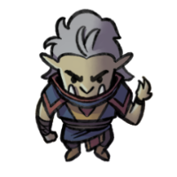

## Bio
> [!infobox]
> # Kiris Acquermann
> 
> ###### Bio
> | Type | Stat |
> | ---- | ---- |
> | Aliases | Kiris|
> | Race| half-orc |
> | Gender| male|
> | Age | young adult|
> | Alignment|| 
> | Background| Sorcerer|
> | Location|  [Yvernus District](../Locations/Areas/Yvernus%20District.md)|
> | Faction| [Seven Up...](../Factions/Seven%20Up....md)| 
##### Known for being: 
### Description
#### Class: Sorcerer
#### Subclass: [Shadow Magic Sorcerer](https://dnd5e.wikidot.com/sorcerer:shadow-magic)
### Backstory
A half orc in search of his lineage. [Kiris](Kiris%20Acquermann.md) was raised by his mother, [Sera](../../Sera.md), in a cursed and secluded place: the cold wilderness of [Lazagog's Forest](../Locations/Areas/Lazagog's%20Forest.md). Growing up, he discovered that he has this untapped magic ability within him. [Kiris](Kiris%20Acquermann.md) tried to control it himself, but to no avail. He can cast basic spells, sure, but he knows that there is much, much more to this uncanny skill; even so for an orc.

And he was an orc, for a time. As he grew older, he began to notice features that resembled a human rather than an orc: smoother skin, lighter pigmentation, smaller set of tusks, and a preference for cooked food. But [Kiris](Kiris%20Acquermann.md) is not only a half-orc; he is a magic-wielding half-orc. He intuits that maybe that is the reason her mother and him lived away from orc tribes: to conceal her peculiar son.

All the time [Kiris](Kiris%20Acquermann.md) spent in the forest with his mother made him wonder about his father’s identity. His eagerness to know the truth gave him negative emotions; he even thought that his father hated him, and they were banished to the forest because of his mixed race. His secretive mother always dismissed his questions about his father. But it did nothing to sweep his emotions away. Someday, he will learn his father’s secrets.

Time went on, and [Sera](../../Sera.md) became severely ill. [Kiris](Kiris%20Acquermann.md)’ magic, while becoming more powerful, was not able to heal. And since they were miles from known orc healers, Sera eventually died a slow yet peaceful death. She died holding [Kiris](Kiris%20Acquermann.md)’ hand. On her other hand, however, was a box [Kiris](Kiris%20Acquermann.md) had never seen before. The box proved to be the starting point of the young orc’s adventure.

The box contained a curious emblem, 10 gold pieces, and a note from [Sera](../../Sera.md). The letter warned him that knowing the truth of his father’s identity will just bring him harm. However, knowing that [Kiris](Kiris%20Acquermann.md) would just ignore her warning and would continue to find the truth anyway, she wrote him something that may help him: first, that his name is based on his father’s name; and second, that the emblem that is included in the box is his inheritance from his father.

The contents of the box left [Kiris](Kiris%20Acquermann.md) with more questions than answers, yet he felt closer to the truth. It was now up to him to begin his quest on knowing his lineage and identity, a journey that started from the deep wilds of [Lazagog's Forest](../Locations/Areas/Lazagog's%20Forest.md) to a comfortable tavern in [Curkip](../Locations/Settlements/Curkip.md).
### Relationships
#### Family
- Mother: [Sera](../../Sera.md)
## Story log
### Most Recent
- [Session 37](../Session%20Log/Session%2037.md): During a collective vision, [Kiris](Kiris%20Acquermann.md) and [Splix](Spraugh%20'Splix'%20Calix.md), aided by their team, is thrusted into a competitive four-versus-four brawl.
- [Session 37](../Session%20Log/Session%2037.md): During the combat, [Kiris](Kiris%20Acquermann.md) is seen wearing the [Frostborn Armor](Frostborn%20Armor.md).
- [Session 38](../Session%20Log/Session%2038.md): In a vision, [Spekid Frostborn](Spekid%20Frostborn.md) appears to [Kiris](Kiris%20Acquermann.md).
> The serious sorcerer evokes a mild chuckle,
>
> "I saw you beat my rival's successor. As a reward, I shall imbue you with the power of the Northern Frost."
>
> Then, [Spekid](Spekid%20Frostborn.md) draws the sigil of the Northern Frost on [Kiris](Kiris%20Acquermann.md)' forehead. He then doffs the [Frostborn Armor](Frostborn%20Armor.md).
>
> "But my power is still tethered to this extraplanar domain. To unlock it, you must defeat the construct that still wields remnants of me and [Zerrus Zagi](Zerrus%20Zagi.md)'s power."
- [Session 38](../Session%20Log/Session%2038.md): [Kiris](Kiris%20Acquermann.md) swaps his Shield spell to Rime's Binding Ice
- [Session 38](../Session%20Log/Session%2038.md): [Kiris](Kiris%20Acquermann.md) wakes up with the [Frostborn Armor](Frostborn%20Armor.md) attached to him. But it only has 1 frost charge... and it is weighing [Kiris](Kiris%20Acquermann.md) down---the armor does not attune to him.
- [Session 41](../Session%20Log/Session%2041.md): [Splix](Spraugh%20'Splix'%20Calix.md), [Adeena](Adeena%20Oberon.md), [Adikia](Adikia%20Unalome.md), [Noah](Noah%20Skie.md) and [Kiris](Kiris%20Acquermann.md) finds an altar for [Akenatun](Akenatun.md).
- [Session 41](../Session%20Log/Session%2041.md): [Splix](Spraugh%20'Splix'%20Calix.md) offers 25 gp. [Noah](Noah%20Skie.md) offers 2 gp. [Kiris](Kiris%20Acquermann.md) offers an Amulet of Undead. [Adeena](Adeena%20Oberon.md) offers her magical earring. [Adikia](Adikia%20Unalome.md) offers a chipped gold from the [Aureate Rapier](Aureate%20Rapier.md).
- [Session 41](../Session%20Log/Session%2041.md): The [Shadow Knight](Shadow%20Knight.md) bestows [Theobald](Theobald%20Clayhollow.md) a Shadow Sigil resembling that of [Kiris](Kiris%20Acquermann.md)' sigil. The [Knights of the Wayraven](Knights%20of%20the%20Wayraven.md) are revealed to inhabit the [Plane of Shadows](Shadowfell.md).
> [Kiris](Kiris%20Acquermann.md) shows the [Shadow Knight](Shadow%20Knight.md) his sigil.
> *"That sigil belongs to the [Wayravens](Knights%20of%20the%20Wayraven.md), masters from the [Material Realm](Material%20Realm.md) who holds dominion over the [Plane of Shadows](Shadowfell.md)".*
- [Session 41](../Session%20Log/Session%2041.md): [Theobald](Theobald%20Clayhollow.md) gives the Shadow Sigil to [Kiris](Kiris%20Acquermann.md).
- [Session 41](../Session%20Log/Session%2041.md): [Zerrus Zagi](Zerrus%20Zagi.md) and [Spekid Frostborn](Spekid%20Frostborn.md) imparts their power to [Splix](Spraugh%20'Splix'%20Calix.md) and [Kiris](Kiris%20Acquermann.md).
> *"Tough times are ahead, but with our power, we hope that you can prevail."*

### All Entries
- [Session 6](../../Session%206.md): Masked member of [Miledu](Miledu.md)'s cult attack [Kiris Acquermann](Kiris%20Acquermann.md)
- [Session 8](../../Session%208.md): [Kiris](Kiris%20Acquermann.md)' "calling card" glows. It is revealed to be a high family pass with the following letters: [AQM](Acquermann%20Clan.md)
- [Session 12](../../Session%2012.md): [Kirren](Kirren%20Acquermann.md) reveals truth about [Kiris](Kiris%20Acquermann.md) and her: they are half-siblings..
- [Session 12](../../Session%2012.md): [Kirren](Kirren%20Acquermann.md) suggests that [Kiris](Kiris%20Acquermann.md) succeed [Kristofer](Kristofer%20Acquermann.md).
- [Session 13](../../Session%2013.md): [Kiris](Kiris%20Acquermann.md) was unsuccessful in researching the families of Midkip.
- [Session 31](../../Session%2031.md): [Adeena Oberon](Adeena%20Oberon.md) and [Kiris](Kiris%20Acquermann.md) investigates the [King](Riordan%20Kyp.md)'s death.
- [Session 32](../../Session%2032.md): [Arc](Arc.md), [Kiris](Kiris%20Acquermann.md), [Thoradin](Thoradin%20Goodman.md) and [Splix](Spraugh%20'Splix'%20Calix.md) goes to [Kayvan](Kayvan%20Acquermann.md)'s room.
- [Session 32](../../Session%2032.md): [Kayvan](Kayvan%20Acquermann.md) gives a special sending stone to [Kiris](Kiris%20Acquermann.md).
- [Session 33](../../Session%2033.md): [Noah](Noah%20Skie.md), [Kirren](Kirren%20Acquermann.md), and [Michaela](Michaela%20Randall.md) finds [Kiris](Kiris%20Acquermann.md), who caught [Rickard](Rickard%20Kyp.md), falling from the air.
- [Session 35](../../Session%2035.md): [Kiris](Kiris%20Acquermann.md), [Kirren](Kirren%20Acquermann.md), and [Mitarella](Mitarella%20Randall.md) confronts [Kayvan](Kayvan%20Acquermann.md).
- [Session 36](../../Session%2036.md): [Arc](Arc.md) and [Kiris](Kiris%20Acquermann.md) succumbs to freezing cold. Their shadows are longer and darker than before.
- [Session 37](../Session%20Log/Session%2037.md): During a collective vision, [Kiris](Kiris%20Acquermann.md) and [Splix](Spraugh%20'Splix'%20Calix.md), aided by their team, is thrusted into a competitive four-versus-four brawl.
- [Session 37](../Session%20Log/Session%2037.md): During the combat, [Kiris](Kiris%20Acquermann.md) is seen wearing the [Frostborn Armor](Frostborn%20Armor.md).
- [Session 38](../Session%20Log/Session%2038.md): In a vision, [Spekid Frostborn](Spekid%20Frostborn.md) appears to [Kiris](Kiris%20Acquermann.md).
> The serious sorcerer evokes a mild chuckle,
>
> "I saw you beat my rival's successor. As a reward, I shall imbue you with the power of the Northern Frost."
>
> Then, [Spekid](Spekid%20Frostborn.md) draws the sigil of the Northern Frost on [Kiris](Kiris%20Acquermann.md)' forehead. He then doffs the [Frostborn Armor](Frostborn%20Armor.md).
>
> "But my power is still tethered to this extraplanar domain. To unlock it, you must defeat the construct that still wields remnants of me and [Zerrus Zagi](Zerrus%20Zagi.md)'s power."
- [Session 38](../Session%20Log/Session%2038.md): [Kiris](Kiris%20Acquermann.md) swaps his Shield spell to Rime's Binding Ice
- [Session 38](../Session%20Log/Session%2038.md): [Kiris](Kiris%20Acquermann.md) wakes up with the [Frostborn Armor](Frostborn%20Armor.md) attached to him. But it only has 1 frost charge... and it is weighing [Kiris](Kiris%20Acquermann.md) down---the armor does not attune to him.
- [Session 41](../Session%20Log/Session%2041.md): [Splix](Spraugh%20'Splix'%20Calix.md), [Adeena](Adeena%20Oberon.md), [Adikia](Adikia%20Unalome.md), [Noah](Noah%20Skie.md) and [Kiris](Kiris%20Acquermann.md) finds an altar for [Akenatun](Akenatun.md).
- [Session 41](../Session%20Log/Session%2041.md): [Splix](Spraugh%20'Splix'%20Calix.md) offers 25 gp. [Noah](Noah%20Skie.md) offers 2 gp. [Kiris](Kiris%20Acquermann.md) offers an Amulet of Undead. [Adeena](Adeena%20Oberon.md) offers her magical earring. [Adikia](Adikia%20Unalome.md) offers a chipped gold from the [Aureate Rapier](Aureate%20Rapier.md).
- [Session 41](../Session%20Log/Session%2041.md): The [Shadow Knight](Shadow%20Knight.md) bestows [Theobald](Theobald%20Clayhollow.md) a Shadow Sigil resembling that of [Kiris](Kiris%20Acquermann.md)' sigil. The [Knights of the Wayraven](Knights%20of%20the%20Wayraven.md) are revealed to inhabit the [Plane of Shadows](Shadowfell.md).
> [Kiris](Kiris%20Acquermann.md) shows the [Shadow Knight](Shadow%20Knight.md) his sigil.
> *"That sigil belongs to the [Wayravens](Knights%20of%20the%20Wayraven.md), masters from the [Material Realm](Material%20Realm.md) who holds dominion over the [Plane of Shadows](Shadowfell.md)".*
- [Session 41](../Session%20Log/Session%2041.md): [Theobald](Theobald%20Clayhollow.md) gives the Shadow Sigil to [Kiris](Kiris%20Acquermann.md).
- [Session 41](../Session%20Log/Session%2041.md): [Zerrus Zagi](Zerrus%20Zagi.md) and [Spekid Frostborn](Spekid%20Frostborn.md) imparts their power to [Splix](Spraugh%20'Splix'%20Calix.md) and [Kiris](Kiris%20Acquermann.md).
> *"Tough times are ahead, but with our power, we hope that you can prevail."*
