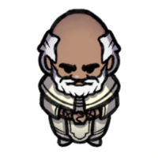

## Bio
> [!infobox]
> # Theobald Clayhollow
> 
> ###### Bio
> | Type | Stat |
> | ---- | ---- |
> | Aliases | Theobald,Theo|
> | Race| human |
> | Gender| male|
> | Age | old|
> | Alignment|| 
> | Background| Cleric|
> | Location|  [Effil](../Locations/Settlements/Effil.md)|
> | Faction| [Seven Up...](../Factions/Seven%20Up....md)| 
##### Known for: A devout cleric of [Aisef](../Deities/New%20Gods/Aisef.md)
### Description
#### Class: Cleric
#### Subclass: [Life Domain](https://dnd5e.wikidot.com/cleric:life)
### Backstory
[Theobald](Theobald%20Clayhollow.md) hailed from [Yelkor](../Locations/Settlements/Yelkor.md), a town on the outskirts of [Curkip](../Locations/Settlements/Curkip.md). His beloved parents, [Theo](../../Theo%20Clayhollow.md) and [Rhela Clayhollow](../../Rhela%20Clayhollow.md), owned a family business selling mostly pots, bowls, and cups. Their clay business gave Theobald and his older brother, [Theodore Clayhollow](../../Theodore%20Clayhollow.md), a fairly decent living. In his younger years, [Theobald](Theobald%20Clayhollow.md) used to work with his father and brother as traveling merchants. Theodore was always in charge of helming the caravan, while [Theobald](Theobald%20Clayhollow.md) preached their wares to the people.

>Theobald is an optimistic, delightful, wholesome, elderly human cleric that resides in [Effil](../Locations/Settlements/Effil.md). All his life, he is an acolyte to [Aisef](../Deities/New%20Gods/Aisef.md)f, the Goddess of Healing. He used to preach the words of [Aisef](../Deities/New%20Gods/Aisef.md) from the [Temple of Aisef](../Locations/Buildings/Temple%20of%20Aisef.md) in Effil for a long time; that is, until he decided to volunteer in the [Effil Orphanage](../Locations/Buildings/Effil%20Orphanage.md) as a Lifetender. A preacher first, and a healer second, Theobald uses his divine gifts to heal the sick orphans in his care. “To acquire a body that is healthy, and a soul that is pure '', that is what he tells the children. When he is not healing, he likes to share stories to the kids. He always tells the stories of [Aisef](../Deities/New%20Gods/Aisef.md) and her way of life to the kids before bedtime.  As time went by, his stories became repetitive. One time, a little girl in her pajamas, bored and fed up with the never-ending stories of [Aisef](../Deities/New%20Gods/Aisef.md) goes to him and asks: 
>
>*“Grandpa Theo, do you have any other stories other than the Everhealing Goddess? Maybe something that you did yourself?”*

The family business made significant profits selling claywares to the surrounding towns; this obligated the two brothers to travel around [Kippian](../Locations/Kingdoms/Kingdom%20of%20United%20Kippian.md) more, sometimes without their father. One day, as the two were traveling through a forest south of [Yorvengarde Mountains](../Locations/Areas/Yorvengarde%20Mountains.md), they encountered a pack of hungry dire wolves along the path, eyeing the horse [Theodore Clayhollow](../../Theodore%20Clayhollow.md) was riding. Before they could react, the wolves started to pounce. The horse fell and so did [Theodore](../../Theodore%20Clayhollow.md). The caravan was shaken and Theobald was incapable of doing anything. The wolves did not see [Theodore](../../Theodore%20Clayhollow.md) as food, but rather as a threat, so the half ganged on him while the other half tore the poor horse. They ripped [Theodore](../../Theodore%20Clayhollow.md)’s right leg and arm, carrying the latter as some sort of a trophy.

[Theobald](Theobald%20Clayhollow.md), who stayed inside the caravan the whole time, was not a pious man before. But given the situation, he closed his eyes and prayed, out of desperation, to the unknown. He intended for his brother to be relieved from the pain so he prayed to those who could hear his plea. 

A female voice echoed through the air:

>[!quote|mark] [Aisef](../Deities/New%20Gods/Aisef.md)
>*“[Theobald](Theobald%20Clayhollow.md), son of [Theo](../../Theo%20Clayhollow.md), worry not, for I hear you.”*

After hearing the faint echoes of that eerily familiar voice, he realized that he was clutching a pendant with a curious symbol. He held it firmly and it began to glow faintly. A divine energy emanating from the necklace seemed to traverse to his hand. [Theobald](Theobald%20Clayhollow.md) raised his hand, and a bright light burst from it, scaring the wolves away. He then placed his hand on [Theodore](../../Theodore%20Clayhollow.md)’s wounds, and they sealed almost instantly.

[Theobald](Theobald%20Clayhollow.md) carried [Theodore](../../Theodore%20Clayhollow.md) and headed back to [Yelkor](../Locations/Settlements/Yelkor.md). [Theo](../../Theo%20Clayhollow.md) and [Rhela Clayhollow](../../Rhela%20Clayhollow.md) immediately tended to [Theodore](../../Theodore%20Clayhollow.md), who was unconscious half the time. Tired from the journey, [Theobald](Theobald%20Clayhollow.md) slept on his bed. As [Theobald](Theobald%20Clayhollow.md) was deep in his sleep, a vision from the goddess [Aisef](../Deities/New%20Gods/Aisef.md) occurred to him. In that instant, he awoke. He packed up his things and prepared himself for his journey. His parents, still half asleep, noticed him gathering his things. 

>[!quote|mark] [Theobald](Theobald%20Clayhollow.md)
>*“Father, I finally know my purpose. I am going to [Effil](../Locations/Settlements/Effil.md) to preach [Aisef](../Deities/New%20Gods/Aisef.md). [Aisef](../Deities/New%20Gods/Aisef.md) needs me. Mother, please take care of my brother, and tell him that [Aisef](../Deities/New%20Gods/Aisef.md) relieved him from his pain, not me. I may be gone for a long time, but I will try to visit when I get the chance. Thank you for everything.”* 

He headed to [Effil](../Locations/Settlements/Effil.md) and served [Aisef](../Deities/New%20Gods/Aisef.md) for the rest of his life. For the next 40 years, he preached the words of [Aisef](../Deities/New%20Gods/Aisef.md), performed her sacred rites, healed the sick and injured, and made offerings. That was until an orphanage was built not far from the [Temple of Aisef](../Locations/Buildings/Temple%20of%20Aisef.md). He took this opportunity to gain more worshippers by preaching words of [Aisef](../Deities/New%20Gods/Aisef.md) to the little kids at the orphanage.

As his responsibilities in the orphanage increased, [Theobald](Theobald%20Clayhollow.md) eventually decided to reside there permanently. Those who were wounded or sick go to the orphanage from time to time to request divine healing from [Theobald](Theobald%20Clayhollow.md), and he happily obliged. The kids witnessed all these divine miracles, which brought them closer to [Theobald](Theobald%20Clayhollow.md) and to his goddess.

[Theobald](Theobald%20Clayhollow.md) was happy with his life at the orphanage. He was content with what he had.

>The little girl, still not sleepy, was eagerly waiting for his Grandpa [Theo](Theobald%20Clayhollow.md) to tell another story. [Theobald](Theobald%20Clayhollow.md), while thinking of other stories he can share with her, said:
>
>*“Have I already told you how I met the Everhealing Godde--?”
>
>“Yes! All the time!” The little girl interjected. “Grandpa Theo, do you have other awesome adventures that you did yourself?”
>
>Theobald, who was a devotee of [Aisef](../Deities/New%20Gods/Aisef.md) for most of his life replied: 
>
>*“I haven’t been on an adventure before. But tell you what, if you brush your teeth now and go to bed early, I promise to tell you the most epic story of your life. I’m not sure when, but you will be the first one to hear!”*

A little later, Theobald left for [Curkip](../Locations/Settlements/Curkip.md), searching for an adventure. What ordeals he will confront, he does not know: all he knows is that his goddess [Aisef](../Deities/New%20Gods/Aisef.md) will always be with him.
### Relationships
#### Family
- Parents: [Theo](../../Theo%20Clayhollow.md) and [Rhela Clayhollow](../../Rhela%20Clayhollow.md) 
- Brother: [Theodore Clayhollow](../../Theodore%20Clayhollow.md)
## Story log
### Most Recent
- [Session 31](../../Session%2031.md): [Theobald](Theobald%20Clayhollow.md) casts Zone of Truth. [Mitarella](Mitarella%20Randall.md), [Remus Kyp](Remus%20Kyp.md), and 4 royal guards.
- [Session 33](../../Session%2033.md): The party interrogates [Rickard](Rickard%20Kyp.md); [Theobald](Theobald%20Clayhollow.md) casts Zone of Truth. [Michaela](Michaela%20Randall.md) and [Mitarella](Mitarella%20Randall.md) succeed the check. [Kirren](Kirren%20Acquermann.md), [Remus](Remus%20Kyp.md), and [Rickard](Rickard%20Kyp.md) fails.
- [Session 34](../../Session%2034.md): [Adikia](Adikia%20Unalome.md), [Adeena](Adeena%20Oberon.md), [Theobald](Theobald%20Clayhollow.md), [Arc](Arc.md) and [Thoradin](Thoradin%20Goodman.md) enters the [Arcanus Labyrinthus](Arcanus%20Labyrinthus.md).
- [Session 36](../../Session%2036.md): The [[Seven Up...|party]] is joined by [Theobald](Theobald%20Clayhollow.md).
- [Session 38](../Session%20Log/Session%2038.md): In a vision,[Theobald](Theobald%20Clayhollow.md)'s[Matunda's Mace](Matunda's%20Mace.md) glows,
> You see [Astar](Astar.md), [Theobald](Theobald%20Clayhollow.md)'s lost eagle, traveling to the moon, an ominous sign that your beloved pet is now resting in the afterlife.
- [Session 40](../Session%20Log/Session%2040.md): [Theobald](Theobald%20Clayhollow.md) finds some notes detailing the construction of the [Guardians of Ice and Fire](Guardians%20of%20Ice%20and%20Fire.md) by [Zerrus Zagi](Zerrus%20Zagi.md) and [Spekid Frostborn](Spekid%20Frostborn.md).
> Within the [Guardians of Ice and Fire](Guardians%20of%20Ice%20and%20Fire.md) are the keys to disabling the barrier that separates the Hall of [Akenatun](Akenatun.md) from the labyrinthus.
- [Session 41](../../Session%2041.md): [Theobald](Theobald%20Clayhollow.md), [Thoradin](Thoradin%20Goodman.md) and [Arc](Arc.md) receives gold for their exploration.
- [Session 41](../../Session%2041.md): The [Shadow Knight](Shadow%20Knight.md) bestows [Theobald](Theobald%20Clayhollow.md) a Shadow Sigil resembling that of [Kiris](Kiris%20Acquermann.md)' sigil. The [Knights of the Wayraven](Knights%20of%20the%20Wayraven.md) are revealed to inhabit the [Plane of Shadows](Shadowfell.md).
> [Kiris](Kiris%20Acquermann.md) shows the [Shadow Knight](Shadow%20Knight.md) his sigil.
> *"That sigil belongs to the [Wayravens](Knights%20of%20the%20Wayraven.md), masters from the [Material Realm](Material%20Realm.md) who holds dominion over the [Plane of Shadows](Shadowfell.md)".*
- [Session 41](../../Session%2041.md): [Theobald](Theobald%20Clayhollow.md) gives the Shadow Sigil to [Kiris](Kiris%20Acquermann.md).
- [Session 41](../../Session%2041.md): [Theobald](Theobald%20Clayhollow.md) asks the casters about the wielder of [Matunda's Mace](Matunda's%20Mace.md).
> *"[Yugad](Yugad%20Matunda.md), the first amalgam cleric, weaves death and life into a single, inseparable thesis: there is no life without death."*

### All Entries
- [Session 13](../../Session%2013.md): [Theobald](Theobald%20Clayhollow.md) found a book about detailing the jungle continent of [Suirsya](Suirsya.md):
- [Session 31](../../Session%2031.md): [Theobald](Theobald%20Clayhollow.md) casts Zone of Truth. [Mitarella](Mitarella%20Randall.md), [Remus Kyp](Remus%20Kyp.md), and 4 royal guards.
- [Session 33](../../Session%2033.md): The party interrogates [Rickard](Rickard%20Kyp.md); [Theobald](Theobald%20Clayhollow.md) casts Zone of Truth. [Michaela](Michaela%20Randall.md) and [Mitarella](Mitarella%20Randall.md) succeed the check. [Kirren](Kirren%20Acquermann.md), [Remus](Remus%20Kyp.md), and [Rickard](Rickard%20Kyp.md) fails.
- [Session 34](../../Session%2034.md): [Adikia](Adikia%20Unalome.md), [Adeena](Adeena%20Oberon.md), [Theobald](Theobald%20Clayhollow.md), [Arc](Arc.md) and [Thoradin](Thoradin%20Goodman.md) enters the [Arcanus Labyrinthus](Arcanus%20Labyrinthus.md).
- [Session 36](../../Session%2036.md): The [[Seven Up...|party]] is joined by [Theobald](Theobald%20Clayhollow.md).
- [Session 38](../Session%20Log/Session%2038.md): In a vision,[Theobald](Theobald%20Clayhollow.md)'s[Matunda's Mace](Matunda's%20Mace.md) glows,
> You see [Astar](Astar.md), [Theobald](Theobald%20Clayhollow.md)'s lost eagle, traveling to the moon, an ominous sign that your beloved pet is now resting in the afterlife.
- [Session 40](../Session%20Log/Session%2040.md): [Theobald](Theobald%20Clayhollow.md) finds some notes detailing the construction of the [Guardians of Ice and Fire](Guardians%20of%20Ice%20and%20Fire.md) by [Zerrus Zagi](Zerrus%20Zagi.md) and [Spekid Frostborn](Spekid%20Frostborn.md).
> Within the [Guardians of Ice and Fire](Guardians%20of%20Ice%20and%20Fire.md) are the keys to disabling the barrier that separates the Hall of [Akenatun](Akenatun.md) from the labyrinthus.
- [Session 41](../../Session%2041.md): [Theobald](Theobald%20Clayhollow.md), [Thoradin](Thoradin%20Goodman.md) and [Arc](Arc.md) receives gold for their exploration.
- [Session 41](../../Session%2041.md): The [Shadow Knight](Shadow%20Knight.md) bestows [Theobald](Theobald%20Clayhollow.md) a Shadow Sigil resembling that of [Kiris](Kiris%20Acquermann.md)' sigil. The [Knights of the Wayraven](Knights%20of%20the%20Wayraven.md) are revealed to inhabit the [Plane of Shadows](Shadowfell.md).
> [Kiris](Kiris%20Acquermann.md) shows the [Shadow Knight](Shadow%20Knight.md) his sigil.
> *"That sigil belongs to the [Wayravens](Knights%20of%20the%20Wayraven.md), masters from the [Material Realm](Material%20Realm.md) who holds dominion over the [Plane of Shadows](Shadowfell.md)".*
- [Session 41](../../Session%2041.md): [Theobald](Theobald%20Clayhollow.md) gives the Shadow Sigil to [Kiris](Kiris%20Acquermann.md).
- [Session 41](../../Session%2041.md): [Theobald](Theobald%20Clayhollow.md) asks the casters about the wielder of [Matunda's Mace](Matunda's%20Mace.md).
> *"[Yugad](Yugad%20Matunda.md), the first amalgam cleric, weaves death and life into a single, inseparable thesis: there is no life without death."*
